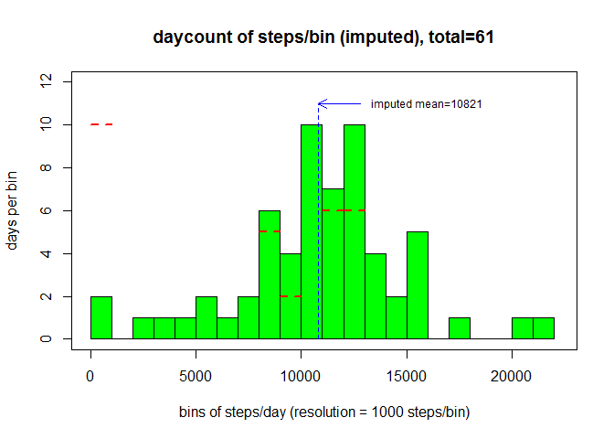
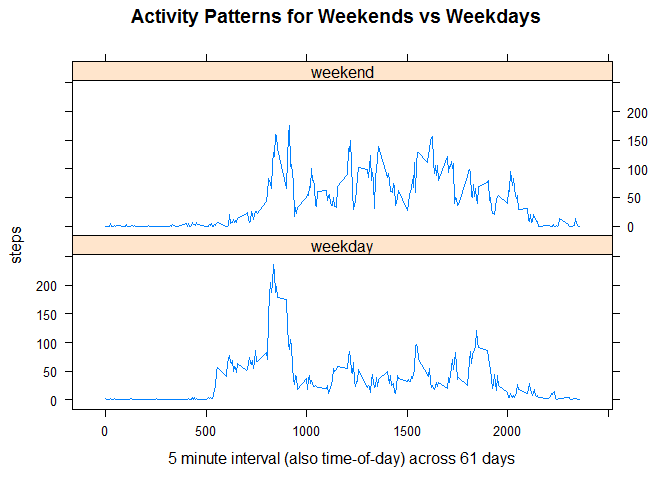

# file PA1_template.Rmd

This HTML document is derived from an R markdown file generated by knitr and describes my effort to complete PeerAssignment1 for the Coursera class Reproducible Research, August 2014.  This assignment makes use of data from a personal activity monitoring device. This device collects data at 5 minute intervals through out the day. The data consists of two months of data from an anonymous individual collected during the months of October and November, 2012 and record the number of steps taken in 5 minute intervals each day.  The CSV dataset may be obtained from [activity.zip](https://d396qusza40orc.cloudfront.net/repdata%2Fdata%2Factivity.zip).  Unzip it before executing this script.

The main assignment questions are repeated in **bold** below to help the reader associate my progress in the assignment.

### Software Environment

This is included for reproducibility.


```r
(elapsed <- Sys.time())
```

```
## [1] "2014-08-16 19:23:55 PDT"
```

```r
sessionInfo()
```

```
## R version 3.1.1 (2014-07-10)
## Platform: i386-w64-mingw32/i386 (32-bit)
## 
## locale:
## [1] LC_COLLATE=English_United States.1252 
## [2] LC_CTYPE=English_United States.1252   
## [3] LC_MONETARY=English_United States.1252
## [4] LC_NUMERIC=C                          
## [5] LC_TIME=English_United States.1252    
## 
## attached base packages:
## [1] stats     graphics  grDevices utils     datasets  methods   base     
## 
## loaded via a namespace (and not attached):
## [1] digest_0.6.4     evaluate_0.5.5   formatR_0.10     htmltools_0.2.4 
## [5] knitr_1.6        rmarkdown_0.2.53 stringr_0.6.2    tools_3.1.1     
## [9] yaml_2.1.13
```

### Loading and preprocessing the data

First read the CSV file into a dataframe.

```r
activity <- read.csv("activity.csv", stringsAsFactors=FALSE)
(LDAY <- 12*24)                     # observations/day, used often!
```

```
## [1] 288
```

```r
(TDAYS <- nrow(activity) %/% LDAY)  # total number of observation days
```

```
## [1] 61
```
Here is a sample of 3 sections of the dataframe (beginning,middle,end).

```r
bb <- nrow(activity)
activity[c(1:3,(bb %/% 2):(bb %/% 2 + 2),(bb-2):bb),]
```

```
##       steps       date interval
## 1        NA 2012-10-01        0
## 2        NA 2012-10-01        5
## 3        NA 2012-10-01       10
## 8784      0 2012-10-31     1155
## 8785      0 2012-10-31     1200
## 8786      0 2012-10-31     1205
## 17566    NA 2012-11-30     2345
## 17567    NA 2012-11-30     2350
## 17568    NA 2012-11-30     2355
```
Notice that the data includes NAs for missing observations.  Further inspection of the dataframe shows that it contains all NAs for certain days.  Every observation on those days is an NA.  On days where there are observations, the 
total number of steps is nonzero.  Thus I will represent days lacking observations
with zero steps taken for every observation.  First replace the NAs:

```r
na_rows <- which(is.na(activity$steps)) # remember for later use!
activity$steps[na_rows] <- 0
```
Finally, for assistance in assigning imputed values later, add a variable that indicates the day-of-week for each observation.

```r
activity$dayofweek <- "Sunday"          # init all
for(i in seq(1,nrow(activity),LDAY))    # correct
    activity$dayofweek[i:(i + LDAY - 1)] <- weekdays(as.Date(activity$date[i],'%Y-%m-%d'))
```

### What is mean total number of steps taken per day?

Aggregate the days while summing the steps.

```r
stepsperday <- aggregate(steps ~ date, data=activity, sum)
```

This is the code to generate the subsequent histogram.


```r
h <- hist(stepsperday$steps, breaks=seq(0,1000+max(stepsperday$steps),1000),
        xlim=c(0,1000 + max(stepsperday$steps)),
        ylim=c(0,12), col="green",
        xlab="bins of steps/day (resolution=1000)",
        ylab="days per bin",
        main=paste0("daycount of steps/bin, total=", TDAYS))
box()

# function also used later, must be declared above first reference!
arrow_text <- function(ax0,ay0,ax1,ay1,tx,ty,dir,the_text) {
    arrows(x0=ax0, y0=ay0, length = 0.1, code = dir, col="blue",
           x1=ax1, y1=ay1)
    text(tx, ty, the_text, cex=0.75, adj = c(0.0, NA))
}

mymean <- mean(stepsperday$steps[stepsperday$steps > 0])
arrow_text(1000,-1+h$counts[1], 2000, -1+h$counts[1], 2500, h$counts[1]-1,1,
    paste0(sum(0 == stepsperday$steps)," of these days have\n no observations"))
segments(x0=mymean, y0 = 0, lty=2, x1=mymean, y1 = 1 + max(h$counts))
arrow_text(mymean,1+max(h$counts), mymean+2000, 1+max(h$counts), mymean+2500,
           1 + max(h$counts),1,paste0("mean=",round(mymean,0)))
arrow_text(18000,  7, 16000, 5.5, 16000, 8,2,
           "e.g. 5 days recorded where\n15000-15999 steps each\nday occurred")
```

 

The histogram above shows the number of days per bin of total steps/day.  Note that the first bin includes the days where no observations were collected.  The mean value for observational days is

```r
mean(stepsperday$steps[stepsperday$steps > 0])      # do NOT include NA days
```

```
## [1] 10766
```
The median value for observational days is

```r
median(stepsperday$steps[stepsperday$steps > 0])    # do NOT include NA days
```

```
## [1] 10765
```
Construct a dataframe containing the mean and median.  We will add another row later when imputed values for missing observations are included.

```r
mean_median <- data.frame(matrix(ncol = 2, nrow = 2))
rownames(mean_median) <- c("raw","imputed")
colnames(mean_median) <- c("mean","median")
mean_median["raw","mean"]   <- mean(stepsperday$steps[stepsperday$steps > 0])
mean_median["raw","median"] <- median(stepsperday$steps[stepsperday$steps > 0])
mean_median
```

```
##          mean median
## raw     10766  10765
## imputed    NA     NA
```

### What is the average daily activity pattern?

Aggregate the days per time intervals while averaging the steps.

```r
stepsperinterval <- aggregate(steps ~ interval, data=activity, mean)
```
Here is the code to generate the subsequent plot.


```r
plot(activity$interval[1:(LDAY)], stepsperinterval$steps, xaxt = 'n',
     type='l', col="red",
     xlab="day interval (also time-of-day)",
     ylab="steps",
     main=paste0("steps/interval, averaged for all ", TDAYS, " days"))
axis(1, labels = c('0:00', '5:00', '10:00', '15:00', '20:00'),
            at = c(0, 500, 1000, 1500, 2000))

arrow_text( 400, 25, 525, 25,   0, 35,2,"rolling out of bed!")
arrow_text( 650,125, 800,125, 400,125,2,"workplace\nactivity!")
arrow_text(1050, 65,1200, 65,1000, 85,2,"lunch\ntime!")
arrow_text(1370, 75,1525, 75,1300, 90,2,"workplace\nactivity")
arrow_text(1925, 65,2050, 65,2000, 75,1,"activities\nat home?")
arrow_text(1725, 75,1725, 90,1600,100,1,"going\nhome?")
arrow_text(2200, 40,2100, 25,2200, 50,2,"winding\ndown!")

peaksteps <- stepsperinterval[which.max(stepsperinterval$steps),"steps"]
peakintvl <- stepsperinterval[which.max(stepsperinterval$steps),"interval"]
arrow_text(peakintvl,peaksteps,peakintvl+100,peaksteps,1000,peaksteps,1,
         paste0("max=",round(peaksteps,1)," at ",peakintvl))
segments(x0=peakintvl, y0=0, col="blue", lty=2,
         x1=peakintvl, y1=50)
```

 

The plot above shows the averaged daily activity, across all observation days.  I have annotated various peaks with likely specific activities.  The maximum steps occurred for any interval, averaged across all days, is

```r
stepsperinterval[which.max(stepsperinterval$steps),"steps"]
```

```
## [1] 179.1
```
at time interval

```r
stepsperinterval[which.max(stepsperinterval$steps),"interval"]
```

```
## [1] 835
```
Not surprisingly, this occurs in the morning, probably getting to the place of business/work.

### Imputing missing values

The number of rows with missing values is

```r
length(na_rows)
```

```
## [1] 2304
```

As mentioned earlier, the missing values occur for all time intervals on certain days.  **It would seem to me that a good _strategy_ of imputing values is to determine the day-of-week that the missing values occur, and substitute the average value of the KNOWN time intervals in the dataset for the same day-of-week.  The assumption made here is that the individual performs the same activities for equivalent weekdays.**  Worst case, assume there is at least one occurrence of every missing day-of-week, so construct a matrix of averaged steps/interval for each KNOWN day-of-week.

```r
activity$steps[na_rows] <- NA    # Put back NAs
dys <- weekdays(as.Date(activity$date[1 + seq(0,LDAY*6,LDAY)],'%Y-%m-%d'))
myavgs <- data.frame(matrix(ncol = 8, nrow = LDAY))
colnames(myavgs) <- c("interval",dys)
myavgs["interval"] <- activity$interval[1:(LDAY)]
for(i in 1:7) {
    valid_days <- !is.na(activity$steps) & (activity$dayofweek == dys[i])
    yy <- aggregate(steps ~ interval, data=activity[valid_days,], mean)$steps
    myavgs[dys[i]] <- yy
}
```
The first 10 rows of the KNOWN averages are displayed.

```r
head(myavgs,10)
```

```
##    interval Monday Tuesday Wednesday Thursday Friday Saturday Sunday
## 1         0  1.429  0.0000     4.250    5.875      0   0.0000  0.000
## 2         5  0.000  0.0000     2.250    0.000      0   0.0000  0.000
## 3        10  0.000  0.0000     0.875    0.000      0   0.0000  0.000
## 4        15  0.000  0.0000     0.000    1.000      0   0.0000  0.000
## 5        20  0.000  0.4444     0.000    0.000      0   0.0000  0.000
## 6        25  5.000  1.4444     0.000    1.375      0   0.0000  7.429
## 7        30  0.000  3.1111     0.000    0.000      0   0.0000  0.000
## 8        35  0.000  0.0000     0.000    5.750      0   0.0000  0.000
## 9        40  0.000  0.0000     0.000    0.000      0   0.0000  0.000
## 10       45  0.000  0.0000     9.000    0.000      0   0.8571  0.000
```
Now create a copy of the original dataset, detect the missing values, and substitute the averaged vector of steps.

```r
days_imputed <- integer(0)  # zero length integer vector
imputed_acts <- read.csv("activity.csv", stringsAsFactors=FALSE)
for(i in seq(1,nrow(activity), LDAY))
    if(is.na(activity$steps[i])) {
        days_imputed <- c(days_imputed, 1 + i %/% (LDAY))   # append
        imputed_acts$steps[i:(i - 1 + LDAY)] <- myavgs[,activity$dayofweek[i]]
    }
cat(length(days_imputed),"of", TDAYS,"days imputed:", days_imputed, "\n")
```

```
## 8 of 61 days imputed: 1 8 32 35 40 41 45 61
```
Aggregate the days while summing the steps.

```r
imputedstepsperday <- aggregate(steps ~ date, data=imputed_acts, sum)
```
Here is the code to generate the following histogram.

```r
hi <- hist(imputedstepsperday$steps, col="green",
        xlim=c(0,1000 + max(imputedstepsperday$steps)),
        ylim=c(0,12),
        xlab="bins of steps/day (resolution = 1000 steps/bin)",
        ylab="days per bin",
        main=paste0("daycount of steps/bin (imputed), total=", TDAYS),
        breaks=seq(0,1000+max(imputedstepsperday$steps),1000))
box()
mymean <- mean(imputedstepsperday$steps)
segments(x0=mymean, y0=0, col="blue", lty=2,
         x1=mymean, y1=1 + max(h$counts))
arrow_text(mymean,1 + max(h$counts), mymean+2000, 1 + max(h$counts),
           mymean+2500, 1 + max(h$counts),1,
           paste0("imputed mean=",round(mymean,0)))
for(i in 1:length(hi$counts))
    if(h$counts[i] != hi$counts[i])
        segments(x0=(i-1)*1000, y0=h$counts[i],
                 x1=i*1000,     y1=h$counts[i], lty=2, lwd=2, col="red")
```

 

The histogram above shows the number of days per bin of total steps/day.  It clearly shows the redistribution of the 8 days of missing values.  For comparison, the horizontal dashed line segments show the original distribution.  Now let's add the imputed mean and median and compare.

```r
mean_median["imputed","mean"]   <- mean(imputedstepsperday$steps)
mean_median["imputed","median"] <- median(imputedstepsperday$steps)
mean_median
```

```
##          mean median
## raw     10766  10765
## imputed 10821  11015
```
Clearly, imputing averages of KNOWN day-of-week steps/interval onto similar days with no observations, the mean and median has increased.

### Are there differences in activity patterns between weekdays and weekends?

Add a new factor variable to the imputed data, indicating if the day is on a weekend or not.  Aggregate by intervals and weekday/weekend, averaging the steps.

```r
imputed_acts$daytype <- ifelse(activity$dayofweek %in% c("Saturday","Sunday"),"weekend","weekday")
imputed_acts$daytype <- as.factor(imputed_acts$daytype)
panel_agg <- aggregate(steps ~ interval + daytype, data=imputed_acts, mean)
```
Here is the code to generate the subsequent lattice panel plot.

```
## Loading required package: lattice
```

```r
xyplot(steps ~ interval | daytype, data=panel_agg, layout=c(1,2), type='l',
       xlab=paste0("5 minute interval (also time-of-day) across ", TDAYS, " days"),
       main="Activity Patterns for Weekends vs Weekdays")
```

 

The panel plot shows the differences between weekend and weekday activities for the same time interval of the day.  It shows for weekend days, rolling out of bed later, more overall steps taken during a day, more steps in the afternoons, and retiring later.

### Conclusion

This concludes my assignment and my story!  Prior to starting it, I kind of dreaded learning a tool that would likely decrease my productivivty with more overhead.  Now I believe in using knitr!

```
## [1] "2014-08-16 19:23:59 PDT"
```

```
## Time difference of 3.38 secs
```
The current time is 2014-08-16 19:23:59.  Total execution time is 3.3798 seconds.
